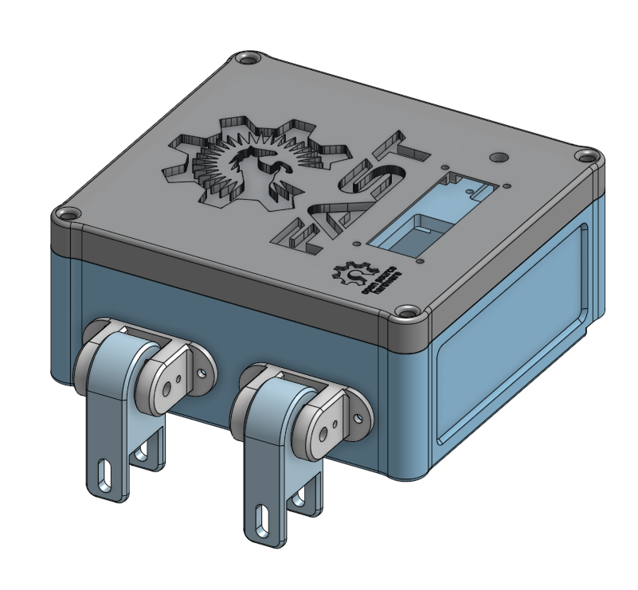
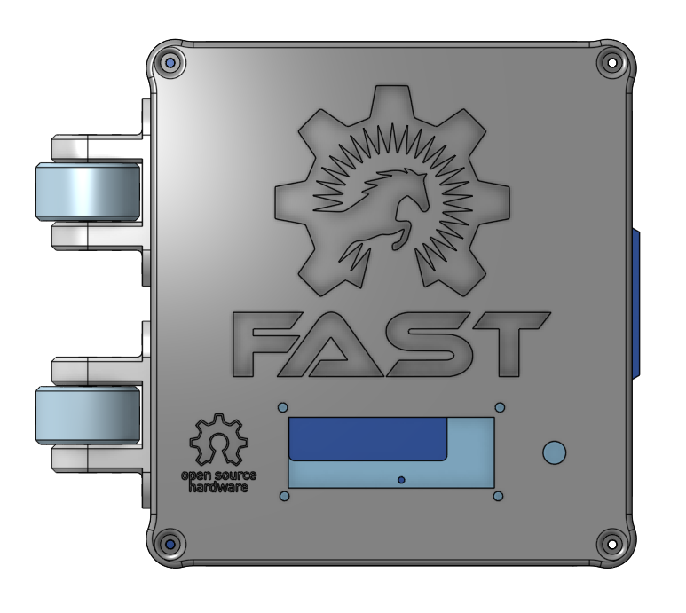

# Electrical Enclosure CAD

THe CAD for the electrical enclosure was made using Onshape by Morgan C. Woods: [Electrical Enclosure - Desktop Sheet Press](https://cad.onshape.com/documents/9d69c9f84549b53a6491ef35/w/14b6a93e6542961346169c7c/e/4beb3684347d9fde3d54fadf).

